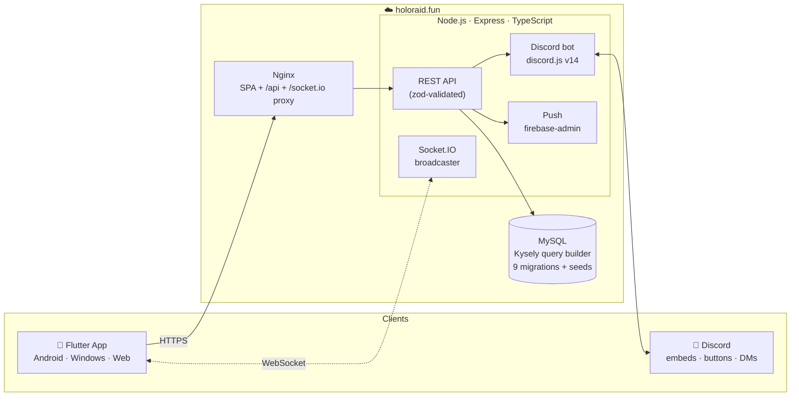

<div align="center">


<br/>

**A holographic command center for organizing Star Wars: The Old Republic™ Operations.**
Plan raids, manage characters, track PvE progression and sync everything with Discord — in real time.

<br/>

[](https://holoraid.fun)
[](app/)
[](backend/)

[](app/pubspec.yaml)
[](backend/tsconfig.json)
[](backend/src/db)
[](backend/src/realtime)
[](backend/src/discord)
[](app/assets/translations)
[](backend/tests)
[](LICENSE)

</div>

---

## 🌌 What is HoloRaid?

**HoloRaid** is a full-stack raid management platform for **SWTOR guilds**. It replaces spreadsheets, copy-pasted Discord messages and manual roster juggling with a single sci-fi themed app inspired by the holographic consoles of the Republic and the Empire.

Guild members sign in with **Discord** (no passwords, ever), register their characters, and join Operations that leaders schedule in seconds. Every boss kill feeds a permanent **PvE progression score** that automatically computes each player's **Tier (0–6)** — and raid leaders can gate sign-ups by minimum Tier. Raid rosters update **live** across every device and inside Discord itself.

> 🎮 **Domain data included:** 22 Operations, 105 bosses, all class/discipline/role combinations — seeded automatically by the migration runner.

## ✨ Features

### 🔐 Discord-native authentication
- OAuth2 sign-in with Discord — no registration forms, no passwords
- JWT session model: 15-minute access tokens + 30-day rotating refresh tokens
- Role-based access (member / admin), with admins bootstrapped via env config

### 🧝 Character roster
- Multiple characters per player: class, discipline, role (🛡️ Tank · 💚 Heal · ⚔️ DPS), faction (Republic / Empire) and item level
- Full class & discipline reference data straight from the game

### 🗓️ Raid planning
- Create Operations with difficulty (Story / Veteran / Master), size (8 / 16), faction, schedule and **minimum Tier requirement**
- Join / leave with a specific character; automatic **waitlist** when the group is full
- Duplicate, start, finish or cancel raids; share by **link or QR code**
- Command Center home screen surfacing your next raid at a glance

### 📈 PvE progression & Tiers
- Permanent points per unique boss defeated, computed server-side
- Automatic Tier ladder:

  | Points | 0–25 | 26–50 | 51–75 | 76–89 | 90–99 | 100–104 | 105+ |
  |:------:|:----:|:-----:|:-----:|:-----:|:-----:|:-------:|:----:|
  | **Tier** | — | T1 | T2 | T3 | T4 | T5 | **T6** |

- Personal boss-kill history + admin award/revoke tools

### 🤖 Discord integration
- Bot posts and **live-edits raid embeds** with Join/Leave buttons
- Slash commands, DM notifications and roster sync — the Discord server is always up to date

### ⚡ Real-time everything
- Socket.IO keeps rosters, dashboards and raid states in sync across Android, Windows, Web and Discord simultaneously

### 🌍 Internationalization
- 5 languages out of the box: **English, Português, Deutsch, Français, Español** (via `easy_localization`, instant in-app switching)

### 🛠️ Admin panel
- User management (promote / demote), guild statistics, progression administration

### 🔔 Push notifications
- Firebase Cloud Messaging device registration + Discord DMs for raid events

## 🏗️ Architecture



**Monorepo layout:**

```
HoloRaid/
├── app/                    # Flutter client (Android · Windows · Web)
│   ├── lib/
│   │   ├── core/           # auth, config, router (go_router), theme
│   │   └── features/       # home, characters, raids, progression,
│   │                       # dashboard, profile, admin
│   └── assets/             # brand, sci-fi fonts, translations (5 langs)
├── backend/                # Node.js + TypeScript API
│   └── src/
│       ├── modules/        # auth, characters, raids, progression,
│       │                   # profile, dashboard, users, devices, reference
│       ├── discord/        # bot, slash commands, embeds, gateway, sync
│       ├── realtime/       # Socket.IO server + event bus
│       ├── db/             # Kysely schema, migrations, repositories
│       ├── common/         # errors, logging (pino), middleware,
│       │                   # security, tier/progression rules
│       └── push/           # FCM integration
└── docs/                   # design specs & implementation plans
```

## 🧰 Tech stack

| Layer | Technology |
|---|---|
| **Frontend** | Flutter (Dart `^3.11`) · Material 3 · Riverpod · go_router · dio · flutter_animate · easy_localization · socket_io_client · qr_flutter · flutter_secure_storage |
| **Backend** | Node.js · TypeScript 5.5 · Express 4 · zod · helmet · express-rate-limit · pino |
| **Database** | MySQL 8 · Kysely (type-safe query builder) · versioned migrations + reference seeds |
| **Realtime** | Socket.IO 4 (server + Flutter client) |
| **Discord** | discord.js 14 (OAuth2, bot, embeds, components, DMs) |
| **Push** | Firebase Admin SDK (FCM) |
| **Auth** | Discord OAuth2 + JWT (access/refresh rotation) |
| **Testing** | Vitest (backend, 55 test files) · flutter_test (widget tests) |
| **Design** | Custom holographic design system · Audiowide / Orbitron / Aldrich / Jura typefaces |

## 🚀 Getting started

### Prerequisites

- **Node.js** ≥ 20 and npm
- **Flutter** (stable channel) with Dart `^3.11`
- **MySQL** 8 running locally
- A **Discord application** (client ID + secret, optionally a bot token) — [Discord Developer Portal](https://discord.com/developers/applications)

### 1. Backend

```bash
cd backend
npm install
cp .env.example .env    # then fill in your values (see table below)
npm run migrate         # creates schema + seeds operations/bosses/classes
npm run dev             # http://localhost:3000 (or your PORT)
```

<details>
<summary><b>Environment variables</b></summary>

| Variable | Description | Default |
|---|---|---|
| `PORT` | API port | `3000` |
| `DB_HOST` / `DB_PORT` / `DB_USER` / `DB_PASSWORD` / `DB_NAME` | MySQL connection | `holoraid` db |
| `JWT_SECRET` | ≥ 32 chars, signs access/refresh tokens | — |
| `ACCESS_TOKEN_TTL` | Access token lifetime | `15m` |
| `REFRESH_TOKEN_TTL_DAYS` | Refresh token lifetime | `30` |
| `DISCORD_CLIENT_ID` / `DISCORD_CLIENT_SECRET` | OAuth2 credentials | — |
| `DISCORD_REDIRECT_URI` | OAuth2 redirect (your web origin) | — |
| `DISCORD_BOT_TOKEN` | Optional — enables bot, DMs & scheduler | — |
| `ADMIN_DISCORD_IDS` | Comma-separated Discord IDs bootstrapped as admins | — |
| `CORS_ORIGINS` | Allowed web origins | — |
| `APP_PUBLIC_URL` | Public URL used in shares/embeds | `https://holoraid.fun` |
| `FIREBASE_SERVICE_ACCOUNT` | Optional — base64 service account for FCM push | — |

</details>

### 2. Flutter app (web)

```bash
cd app
flutter pub get
flutter build web --pwa-strategy=none --no-web-resources-cdn \
  --dart-define=API_BASE_URL=http://localhost:3000
cd build/web
python -m http.server 8899   # open http://localhost:8899
```

> 💡 Make sure `DISCORD_REDIRECT_URI` and `CORS_ORIGINS` in the backend `.env` match the origin serving the web build (e.g. `http://localhost:8899`).

Android / Windows targets work with the same `--dart-define` flags:

```bash
flutter run -d windows --dart-define=API_BASE_URL=http://localhost:3000
```

### 3. Tests

```bash
cd backend && npm test        # Vitest suite
cd app && flutter test        # widget tests
```

## 📡 API overview

<details>
<summary><b>REST endpoints</b> (prefixed with <code>/api</code> in production)</summary>

| Area | Endpoints |
|---|---|
| **Health** | `GET /health` |
| **Auth** | `GET /auth/discord/url` · `POST /auth/callback` · `POST /auth/refresh` · `POST /auth/logout` |
| **Users** | `GET /me` · `PUT /me/push` · `GET /users` 🔒 · `POST /users/:id/promote\|demote` 🔒 |
| **Characters** | `GET/POST /characters` · `GET/PATCH/DELETE /characters/:id` |
| **Raids** | `GET/POST /raids` · `GET /raids/code/:code` · `GET/PATCH/DELETE /raids/:id` · `POST /raids/:id/duplicate\|start\|finish\|cancel\|join` · `DELETE /raids/:id/leave` |
| **Progression** | `GET/PUT /me/bosses` · `POST /admin/users/:id/bosses` 🔒 · `DELETE /admin/users/:id/bosses/:bossId` 🔒 |
| **Reference** | `GET /reference/classes\|bosses\|operations` |
| **Profile** | `GET /me/raids` |
| **Dashboard** | `GET /dashboard` |
| **Devices** | `POST /devices` |

🔒 = admin only. Realtime events are delivered over `/socket.io`.

</details>

## 🎨 Design system

HoloRaid follows a custom **holographic design language** — dark space backdrops, cyan-to-violet gradients (`#76C8FF → #7E7BFF`), glowing role colors (Tank `#7E7BFF` · Heal `#8CFFB7` · DPS `#FF8B5B`) and sci-fi typography. Motion is fast and purposeful (150–250 ms, `easeOut`), with skeleton loading everywhere and micro-interactions on every user action. See [design_system.md](design_system.md).

## 🌐 Deployment

Production runs at **[holoraid.fun](https://holoraid.fun)** on a VPS managed by EasyPanel: a single **Nginx** service serves the Flutter web SPA and proxies `/api` and `/socket.io` to the Node backend, with **MySQL** on the internal network. See [docs/superpowers/specs](docs/superpowers/specs) for the full deployment design.

## 📄 License

Released under the [MIT License](LICENSE) — Copyright © 2026 Leonardo de Souza Guimarães.

---

<div align="center">

*Star Wars: The Old Republic™ and all associated assets are trademarks of Electronic Arts Inc. / Broadsword Online Games.
HoloRaid is an unofficial fan-made tool and is not affiliated with or endorsed by EA, Broadsword or Lucasfilm.*

**May the Force organize your raids.** ✨

</div>
